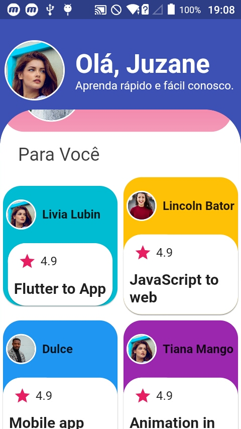
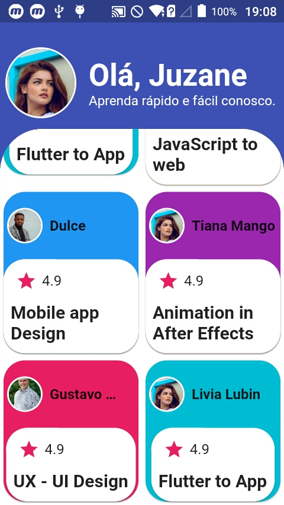
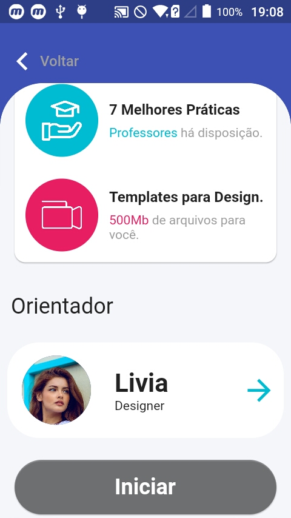

# Course Sample App. 

This is an app showing a course layout.

## Manual setup
To start the app you can run the command `flutter install` to be able to use.


To create new project you can run.

```
 flutter create my-app
 cd my-app
 flutter run
```
| 01                        | 02                        |
|---------------------------|---------------------------|
|  |  |
|  |  |
|  |  |
|  |


A new Flutter project.

## Getting Started

This project is a starting point for a Flutter application.

A few resources to get you started if this is your first Flutter project:

- [Lab: Write your first Flutter app](https://flutter.dev/docs/get-started/codelab)
- [Cookbook: Useful Flutter samples](https://flutter.dev/docs/cookbook)

For help getting started with Flutter, view our
[online documentation](https://flutter.dev/docs), which offers tutorials,
samples, guidance on mobile development, and a full API reference.
